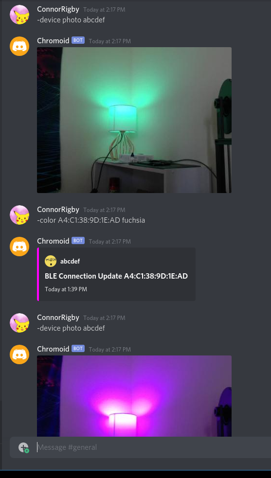

# Chromoid

Elixir stack to control my office lights.

## Basic Usage

* `-help` - print help text.
* `-help [command]` - print more help about a command
* `-device list` - print list of devices.
* `-color [address] [#RRGGBB]` - Set the color of a BLE device with an HTML
code.
* `-color [address] [friendly color]` - Set the color of a BLE device with a
friendly color name such as `red`, `green`, `blue`, `purple`, etc.
* `-device photo [device name]` - Request a photo from a device.

## Screenshots

## Chromoid Web

Phoenix app that handles external connections and integrations.

## Chromoid Link

Nerves app that bridges the web app integrations to BLE devices.

## Disclaimer

Govee, pls don't DMCA me.
